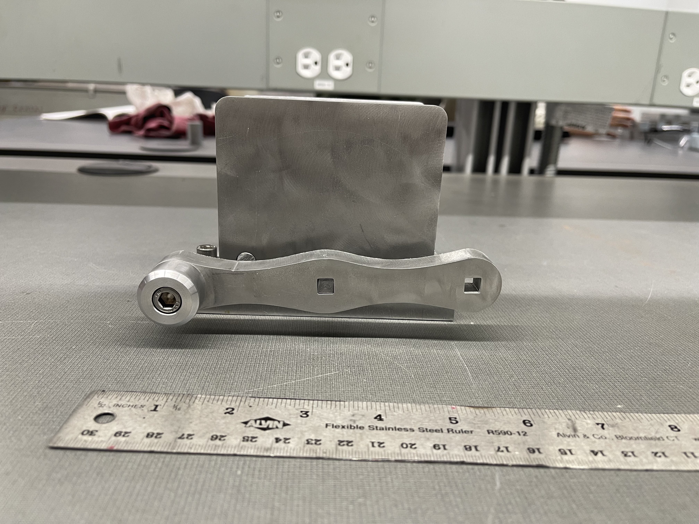

# Portfolio

## Robotic Arm Project   <med>Feb 2023</med>

This robot arm is connected to ROS the Robotic Operating System, I plan to use an Xbox Kinect in the future to allow the robotic arm to gain a 3D understanding of the world around it using MoveIt motion planing.

**Software Utilized**

## Okanagan Engineering   Competition   <med>Feb 2023</med>

During the Western Engineering Competition 2023 my team and I programed the game Battle Ships from scratch in 5 hours. This featured network play over a socket server and a website to host the game. My team won second place.

**Software Utilized**

## Vise Machining Project   November 2022

During my manufacturing class my team was tasked with machining a vise. To do this my team created our design in OnShape and then realized our design with the help of Lathes, Milling Machines, and Water Jet Cutters.

**Software Utilized**

![OnShape](https://shields.io/badge/-OnShape-blue?style=for-the-badge&logo=data:image/png;base64,iVBORw0KGgoAAAANSUhEUgAAAEAAAABACAYAAACqaXHeAAAAAXNSR0IArs4c6QAAAARnQU1BAACxjwv8YQUAAAAJcEhZcwAACxMAAAsTAQCanBgAAAzZSURBVHhe1ZoJWBRHFsffdM8MMMOl3KCARlBxPdB4xSuskE+N8UowEkEjyaIx1xoDkUg8s97HJptzvxwaTYSAmigqQlAxrHjEExRREEQOBQ0MMDD3bFVTgw7Tw1w9Jvl9nx9d/55pp1699+pVVfPg8cOb/s0zPbr5CdfRFN1P1iRL/D766Emka9pvP14eqwGGJQwTDXzO95+0I38ZjwcuWNNqQatRan5srmpMzkj4tQJLWH9cPC4D0LH7Jz8nFAs2UxSvD9H00Gq1UpVCvaXibMuWvNV5LUS2O/Y2AG/2d1EDxF6OW2kB9QzRukSr0VbImxXJu5/PSkdNdbtqP+xlAN6MdRO7uw1y+oDvQC3m8XgCopuNRqXJkz2QL/1hbvZF3GxXuYdzA6A4F/ztWd8FfCd6LY/ieRPZOrRatUqh+Vpa3rwy/Y28e1hpv8EdFPnLBdRLqVHjBz/vXyAQ87+0ufMYHo/u7zMwYXPc11clEslbb775pgO5wxlceABv1lcRgW7+zutQnMegJ3LiVe4O3eGFPi/DCN9xHY9UqVRX6+rqlgYEBOSgJidhYdOPjVo6SBwQEbiEFlLvoRF3JrJN0BQfIns+B1N7zQZH2omo+hTXX/kp5VBi8r4F2SWoaVNYWGsAOjZj8gwHV8FG1PEniGYzA7oPgTl9/wG+ogCi6NOmaoXM8jTIrToEKrVKrlaoPq6/Ill/KDm/Ed22yhCWGoA3Z8ffB4p8xVspPhVJNJvxcPSGF0PjIdxrFFH00Wo1kF+bC/vLdkOzQkLUdjQaba2qVbn8u+1HdkEeqIhsNuYagDd1ywQPz/4uK5C7L7JmWmNDQAlhUtAsmBw8i7lm42bjNUi98RVUNt8iCjto2jwjbZC/kxaTfRo321XTmDRAWHSYcPjcoHi+SLAGubsXkW0m3GskzA55BTyd2CeL32X1kFG6E87dyyeKaXBVrVZodkuqmpfvT8irZiQTdGUAKi5t0jihu2A7j6bCiWYzOL7nhL4KAzzYH6lQy+Fo5X7Iur2fubYGVFY3qdpU64sy7318/r/nW4nMCpsBeNO/nRDU3dd1Pc2nXkSfsDRPsIIz+rMos0ehDI8zPRvY3b+6ug2N/n2i2IZWrb2paFIl7oo+nImarGV1587R8zOnLOc78JNQnIuJZiM8Zi6PRnM6ntu7Qq1Vw/E7h+BAeSqT8blCrVRnyX5XLNkzN/s6kTqgyV8djsPjw35BnWfPSBbSwzkYFg1MgqjAaeDIZ5/TH4XiUdDbrS+M8Y+EVlUL3GkuJ3dsg6KpPqjmVV3eczObSB10LoU5KY1FfGeIQfP5ByO2QYh7GFEfotFo4NixY7Bnzx5obTUcaVehG8zv/wa8P3wTMkgoUW0DhQPum0E4dxbEr/4y3eq1OPIcGOsXCTOfiAMXoStR9SkpKYHU1FSoqalh2i4uLhAdHQ0jR45k2p1BmR0Kao/DvtJdIFE0ENVy5FLlR7umH34HXepNkZwZoJdrKLyERj3YNYQo+jx48AAyMjLgwoULRNGnb9++MHfuXPDx8SGKPh1VIMoRaq3F9Y5RA9js8i7EXZOHb2TtvFKphMzMTFi1apXRzmMEgq5rKye+CKJDFsCqkf82OoVag9UeQPFoiOgxGab1jkExzz5hXLx4EdLT05nRN4a3tzfMnj0bBg4cSBSUtdVqKC0thdDQUCas2LhUfxZ+vPkN1LfdJUrXcB4COMEFuvQmLX1wfKelpcH16wazTgeOjo4wZcoUmDhxIvD5D+uCq1evMkarra2F4OBgmDNnDvTq1Yvc1UepUcJbeTGg0pgOCc4N8FlEOqrf9d0WZ3Ts7idOnGBGkQ08ojjhzZo1C9zc3IgKcPfuXSZHFBYWEqUd3ednzpwJ7u7uRH3I4uOzkSEUpGUcu+UAHUVFRbBixQrIzc012nk8oklJSbBgwQK9zuPPHz582KDzGFTWwunTp5ln5+ebvy4wF84MgN29ubmZtPTBU928efNg2bJl0Lu3YdjQNA3x8fGwdOlSCAhg3wuQy+Vw6dIl0uIOzgzABu5YZGQkrF27FsaMGWM0oenASS8lJQViYmJALOaoEjeBXQ2QmJjIFDlOTqbLYB0URcHTTz8Na9asAVdX9mKKS+xqAA8PD3JlOc7OziZrAy6wqwH+ChgYwN3BulETiUTk6q+FgQE+HP0pTAl+wWCONwUuahYuXAienp5EsR28auQMjZY1AxsYwIF2RKu5WFg96j8wxGsEUc1j6NChTM0/Y8YMcHDg/BDHNige6/6g0Rzg5eQLrw96H5aErwI/cU+iGkdX/ODENXnyZGbqsyT7/1GYTIJh3YfASrQCezEk3uiiB3Pw4EHYu3cvyGQypo0rPVuzuLGK0irMDQGN1jDuaLTyiwychvLDZzDOPwoVNIZ2U6lUkJ2dzZSsBQUFTAn7p8LcEPjXuXfhRkMRaemD1/7z+r8Oy4dvRkZhdx6JRAI7duyAjRs3QkUFfuPlz41BL/AJzOYLKfBF4Ua01sZH8oYEuTzB7Ad0RXl5OWzYsAF27twJTU1NRLUMTmcBI7API+J8XQGsPP0GsxcnU7UR1TJwGJw6dYoJi5ycnC5jGn8Wh87ly5eJYoiptYQ1GDUABm84HLm9F1IKFkN+zS+s+UFHVFQUjB49mvVHtrW1MWt9XN/jDY/O4FDZtGkTEzpsK0r8TPxsvGfINZ39WDh0Xr/3yXUHcrUMLt8/C1funwM/UQB4sJzn4R2eIUOGwIABA6C6uhoaG/GJtT4tLS1w5swZqKysZPYGsIvjnSO8Pd7Q0L7jO3jwYAgMDGSus7KymGtcYOEFEv4/OnOoIh0NjOnZQi1Xn72SVnoUXeolw87DZdaO0DDv0fB8n5dRrcC+g4vdGXd03759TFJkA2+D4WkSe8ejxMXFwdixY5lrvP7HBunK9f+QHSFT+QH/4FGjRjEuP2nSJL09Px142uzc+c5gj7JH3D+KVQbAmJMfsMvivbyVK1cyI2mKoKAgCAlhP1ewF1YbQAc+rdlZ/EmX9QPe+l68eDG8/fbb4OfnR9SH4LV/bGwsJCcnsx6M4NOhU8zp0HdE4Q6zkqA5YEOcqj0GNdLbEOQaAmKB4TtTXl5eMG7cOGa7C9cJeFocP348vPbaa9CnTx9Wd8cHpF8UboJjVZngJfI1eI3G7CSo1Jy5knqTmyRoCryUjuw5jVlWGzsVxjMCnil69OhBFH1aVVL4uewHOFF9pCO8RvlOgFcGLGGudXCdBNVoujhFrq3GnPyA3Z6t89jd/4e+g797rOoQ63ctRaVQl7TWSH9Clwbrgc4hoL6UeyO11zD/MqFYEE7RvIeb91ZgTv3wKLeby+BzVIIfrzrC+nqMnzgQTcFPkVY7XYWAVqNtaq1rXXdyVUHC6W9KbmCp/c5DDAt6KSiLD1RcaapT7fYJdVXynfjhKDZtemHCVH6QKlsgvfRb2H398y5fjwlwDjLLAKgM0SpaFBk3cipfOpJ0+oCkTo5fQmBdDRpb0WgbbjVIC/eW/erSXbRX7CfypIVUGDKETZNyrbQKTlYfRZ4hZ47TaR4fhUgOfHplPdxovMq4f1f4i3vCkz5jSKudzgZA7l5Ud10Sn7Egd9udM3V1SOoyhszpEP6McOqWsWM9+7uv4zvQlu2TGcFN2A3cHLqZfP/vUfDo41duHkWXBLVqTWNzvWx9zorfvkSDhxcUZiUPc+oAPCzyzHfzj+94OXNiwx1pgkalqWq/ZT04LCzpvDFQ2a2RSRS7izNuPfljbM421Hlce5udOY2FABtaaAVF8c+3LjfWKHf7hLlq+I5MfrD/6QXBR+QPI3zGkRYzleb/kLXzlbT47E/uXKjHycPiKcMSA+jQNpY3SosyyvLE3k57XXzFPrSQ7o+yg035wRx8xT0YAygUiupr164tQSvF5OKsWzi7W/7ODMGWUliZv/VS8a6Zh+PuFdZPUsnV54luN+QqubympmZ7QkLCk4MGDdqJJCn613XmNAFXo0aBF4he2DAxziVAlELzKX+ic4ZCqjxafa4uOffD3/CCQ9mu2g7XbkuHTQnyGjy/37uibg6LeRTP5oMBtVJdJrndsnzfohMHUBPvuds04p2xV9wKxicN7Rc02ne10Fkww5r8gKq4Ful92faT24s+qjlXg7eLbK+JWbBn4sLPdpi6fUyEZ2g3XD8MaZdNgKohWYtif+WJuyknP7pYihTO3J0NexpAB+Xh4SGO2Bo+39VPtBytL3yJbgCu4n4vlSw78NavuaiJFwOcujsbj8MAOujwaX19+s8NTnTq5rAI5YeOHU6NRtvQUte2wdIqjgsepwF0CCLeGxEW+JTnGr6I/6ysWfF9ycHq1b99W1iJ7lk9n//VwIZ3GrlwcDD6i8/R/4iBQAD8H1NMRrq1+cGyAAAAAElFTkSuQmCC)

## Self Driving Car Project   Jun 2022

In 2022 I was hired to rewrite the Labs for my class APSC 258 Applications of engineering Design, where I created software and hardware to improve the Labs. This utilized machine learning in Tensorflow and software built on Python and Javascript.

**Software Utilized**

## OEC 2022

## Boeing 747-8 Solidworks   Feb 2021

In my first year at University we were tasked with creating a project in Solidworks. My Team decided on creating a Boeing 747-8. In this project I learned a lot about creating Solidworks models with complex curves and geometry. I also used Blender to create the final renders for my design.

**Software Utilized**

